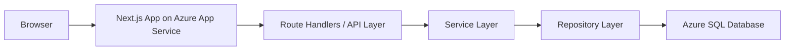
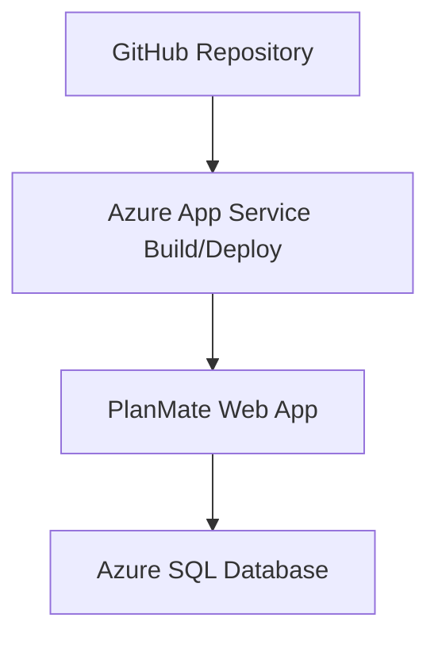

# Architecture

## 1. 개요

PlanMate는 **Next.js 기반 웹 애플리케이션**이며, 일정 데이터는 **Azure SQL Database**, 웹 실행 환경은 **Azure App Service**를 사용한다.  
클라이언트는 데이터베이스에 직접 접근하지 않고, 반드시 서버 API를 통해 데이터에 접근한다.

## 2. 아키텍처 목표

- 단순하고 이해 가능한 구조
- Azure 배포 친화적
- 반복 일정 로직을 서버에서 통제
- 추후 인증/다중 사용자 확장 가능

## 3. 상위 구조



## 4. 레이어 설명

## 4.1 Client Layer
책임:
- 뷰 렌더링
- 사용자 입력 처리
- 일정 조회 요청
- 생성/수정/삭제/완료 액션 수행

구성:
- App Router 페이지
- 캘린더 UI
- 일정 모달
- 상세 패널
- 상태 메시지

원칙:
- 클라이언트는 DB 구조를 몰라도 되도록 한다.
- 반복 일정 계산은 서버 결과를 우선 사용한다.

## 4.2 API Layer
책임:
- 요청 파라미터 검증
- 인증/인가 훅 수용 지점(향후)
- 서비스 호출
- 표준 응답 형식 반환

예시 엔드포인트:
- `GET /api/events/range`
- `POST /api/events`
- `PATCH /api/events/:id`
- `DELETE /api/events/:id`
- `PATCH /api/events/:id/occurrences/:date/complete`

## 4.3 Service Layer
책임:
- 비즈니스 규칙 처리
- 날짜 범위 계산
- 반복 일정 전개(expand)
- 완료 상태 결합
- 삭제/수정 정책 적용

핵심 이유:
반복 일정은 단순 CRUD가 아니라 “규칙 + 날짜 범위 + 발생일 상태”가 함께 계산되어야 하므로, API 핸들러 내부에 모든 로직을 넣지 않고 서비스 레이어로 분리한다.

## 4.4 Repository Layer
책임:
- SQL 실행
- 테이블별 조회/저장 로직 캡슐화
- 파라미터 바인딩
- DB 예외를 상위 계층이 처리할 수 있는 형태로 변환

원칙:
- SQL은 반드시 파라미터 바인딩 사용
- 범위 조회와 상태 조회는 분리해서 최적화 가능하게 유지

## 4.5 Database Layer
핵심 테이블:
- `events`
- `event_occurrences`

의도:
- `events`에는 원본 일정/반복 규칙 저장
- `event_occurrences`에는 개별 발생일의 완료 상태 저장

## 5. 데이터 흐름

## 5.1 일정 생성
1. 사용자가 일정 모달에서 저장
2. 클라이언트가 `POST /api/events` 호출
3. API가 입력 검증
4. 서비스가 규칙 정규화
5. Repository가 `events` 테이블 저장
6. 저장 결과 반환
7. 클라이언트가 캘린더와 상세 목록 갱신

## 5.2 범위 조회
1. 사용자가 월/주/일 뷰 전환 또는 날짜 이동
2. 클라이언트가 기준 날짜와 뷰를 포함해 `GET /api/events/range` 호출
3. 서비스가 조회 범위를 계산
4. Repository가 해당 범위와 겹칠 가능성이 있는 이벤트 시리즈를 조회
5. 서비스가 반복 규칙을 실제 발생일 목록으로 전개
6. `event_occurrences`에서 완료 상태를 조합
7. 클라이언트에 렌더링용 DTO 반환

## 5.3 완료 처리
1. 사용자가 반복 일정의 특정 날짜 항목을 완료 체크
2. 클라이언트가 `PATCH /api/events/:id/occurrences/:date/complete` 호출
3. 서비스가 대상 발생일 유효성 검증
4. Repository가 `event_occurrences`를 upsert
5. 최신 상태 반환

## 6. 폴더 관점 아키텍처

```text
src/
  app/
    page.tsx
    api/
      events/
  components/
  features/
    calendar/
    event-form/
  lib/
    db/
    date/
    api/
  services/
  repositories/
  types/
```

### 의도
- UI와 비즈니스 로직 분리
- 날짜 계산 유틸 별도 관리
- DB 접근 코드 분리
- API DTO 타입 분리

## 7. 배포 아키텍처



### 운영 구성
- 코드 저장소: GitHub
- 앱 호스팅: Azure App Service
- 데이터 저장소: Azure SQL Database
- 설정값: App Service 환경변수
- 로그: App Service 로그 + 애플리케이션 콘솔 로그

## 8. 보안 원칙

- DB 연결 문자열은 절대 클라이언트에 노출하지 않는다.
- 모든 데이터 변경은 서버 API를 통해서만 수행한다.
- SQL 쿼리는 문자열 결합이 아닌 파라미터 바인딩을 사용한다.
- 향후 인증 추가를 고려해 API 레이어에 사용자 컨텍스트 주입이 가능해야 한다.

## 9. 확장 전략

### V2 확장 가능 항목
- 사용자 인증 추가
- 다중 사용자 데이터 분리
- 개별 반복 발생일 예외 수정
- 카테고리/태그
- 리마인더
- 공유 일정

### 구조상 유리한 이유
- 서비스 레이어와 저장 레이어가 분리되어 있어 변경 범위를 예측하기 쉽다.
- `events`와 `event_occurrences`를 분리해 반복 일정의 상태 관리 여지를 남겼다.

## 10. 아키텍처 결론

MVP 기준 가장 중요한 설계 포인트는 아래 두 가지다.

1. **반복 일정은 원본 규칙(events)과 발생일 상태(event_occurrences)를 분리한다.**
2. **캘린더 조회는 서버가 범위를 계산하고 결과를 렌더링용 DTO로 반환한다.**

이 구조를 따르면 기능은 충분히 구현 가능하면서도, 이후 확장에도 대응하기 쉽다.
