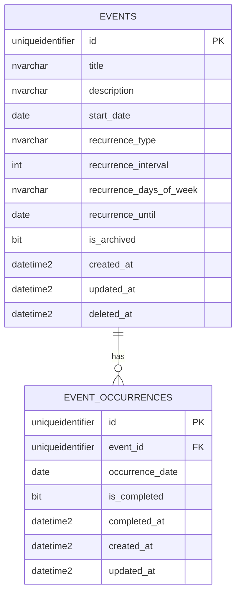

# Database

## 1. 설계 목표

PlanMate 데이터베이스 설계의 핵심 목표는 아래와 같다.

- 날짜 중심 일정 관리에 맞는 단순한 구조
- 반복 일정 지원
- 반복 일정의 **개별 발생일 완료 상태** 저장 가능
- 추후 로그인/다중 사용자 확장 가능

## 2. 설계 원칙

- 반복 규칙 원본은 `events`에 저장한다.
- 특정 날짜의 완료 상태는 `event_occurrences`에 저장한다.
- MVP에서는 개별 발생일 수정/예외 처리는 지원하지 않는다.
- 날짜 기준 앱이므로 시간대 로직을 최소화하기 위해 **우선 날짜(date) 중심**으로 설계한다.

## 3. ERD



## 4. 테이블 정의

## 4.1 events
일정 원본(시리즈) 저장 테이블

### 컬럼
- `id`: 일정 ID
- `title`: 일정 제목
- `description`: 일정 설명
- `start_date`: 원본 기준 날짜
- `recurrence_type`: 반복 유형 (`none`, `daily`, `weekly`, `monthly`)
- `recurrence_interval`: 반복 간격
- `recurrence_days_of_week`: 주간 반복용 요일 목록 (예: `1,3,5`)
- `recurrence_until`: 반복 종료일
- `is_archived`: 보관 여부
- `created_at`, `updated_at`, `deleted_at`: 감사 컬럼

### DDL
```sql
CREATE TABLE dbo.events (
    id UNIQUEIDENTIFIER NOT NULL
        CONSTRAINT PK_events PRIMARY KEY
        DEFAULT NEWID(),

    title NVARCHAR(120) NOT NULL,
    description NVARCHAR(1000) NULL,

    start_date DATE NOT NULL,

    recurrence_type NVARCHAR(20) NOT NULL
        CONSTRAINT CK_events_recurrence_type
        CHECK (recurrence_type IN ('none', 'daily', 'weekly', 'monthly')),

    recurrence_interval INT NOT NULL
        CONSTRAINT DF_events_recurrence_interval DEFAULT 1
        CONSTRAINT CK_events_recurrence_interval CHECK (recurrence_interval >= 1),

    recurrence_days_of_week NVARCHAR(20) NULL,
    recurrence_until DATE NULL,

    is_archived BIT NOT NULL
        CONSTRAINT DF_events_is_archived DEFAULT 0,

    created_at DATETIME2(0) NOT NULL
        CONSTRAINT DF_events_created_at DEFAULT SYSUTCDATETIME(),

    updated_at DATETIME2(0) NOT NULL
        CONSTRAINT DF_events_updated_at DEFAULT SYSUTCDATETIME(),

    deleted_at DATETIME2(0) NULL
);
```

## 4.2 event_occurrences
반복/단일 일정의 특정 발생일 상태 저장 테이블

### 용도
- 특정 날짜의 완료 여부 저장
- 반복 일정도 날짜별 상태를 개별적으로 관리

### 컬럼
- `id`: 발생 상태 ID
- `event_id`: 원본 일정 ID
- `occurrence_date`: 실제 발생 날짜
- `is_completed`: 완료 여부
- `completed_at`: 완료 시각
- `created_at`, `updated_at`: 감사 컬럼

### DDL
```sql
CREATE TABLE dbo.event_occurrences (
    id UNIQUEIDENTIFIER NOT NULL
        CONSTRAINT PK_event_occurrences PRIMARY KEY
        DEFAULT NEWID(),

    event_id UNIQUEIDENTIFIER NOT NULL,
    occurrence_date DATE NOT NULL,

    is_completed BIT NOT NULL
        CONSTRAINT DF_event_occurrences_is_completed DEFAULT 0,

    completed_at DATETIME2(0) NULL,

    created_at DATETIME2(0) NOT NULL
        CONSTRAINT DF_event_occurrences_created_at DEFAULT SYSUTCDATETIME(),

    updated_at DATETIME2(0) NOT NULL
        CONSTRAINT DF_event_occurrences_updated_at DEFAULT SYSUTCDATETIME(),

    CONSTRAINT FK_event_occurrences_event_id
        FOREIGN KEY (event_id)
        REFERENCES dbo.events(id),

    CONSTRAINT UQ_event_occurrences_event_date
        UNIQUE (event_id, occurrence_date)
);
```

## 5. 인덱스

```sql
CREATE INDEX IX_events_start_date
    ON dbo.events(start_date);

CREATE INDEX IX_events_recurrence
    ON dbo.events(recurrence_type, recurrence_until);

CREATE INDEX IX_events_deleted_archived
    ON dbo.events(deleted_at, is_archived);

CREATE INDEX IX_event_occurrences_lookup
    ON dbo.event_occurrences(event_id, occurrence_date);
```

## 6. 저장 전략

## 6.1 단일 일정
- `events`에 한 건 저장
- `recurrence_type = 'none'`
- 완료 체크 시 `event_occurrences`에 `(event_id, occurrence_date)` 상태 저장

## 6.2 반복 일정
- `events`에 한 건만 저장
- 반복 규칙은 `recurrence_type`, `recurrence_interval`, `recurrence_days_of_week`, `recurrence_until`에 저장
- 조회 시 애플리케이션이 날짜 범위 내 발생일을 계산
- 완료 체크 시 해당 발생일만 `event_occurrences`에 저장

## 7. 조회 전략

## 7.1 범위 조회
조회 범위 예시:
- 일별: `2026-03-17 ~ 2026-03-17`
- 주별: `2026-03-16 ~ 2026-03-22`
- 월별: `2026-03-01 ~ 2026-03-31`

### 1단계: 이벤트 후보 조회
```sql
SELECT *
FROM dbo.events
WHERE deleted_at IS NULL
  AND is_archived = 0
  AND start_date <= @rangeEnd
  AND (
        recurrence_type = 'none'
        OR recurrence_until IS NULL
        OR recurrence_until >= @rangeStart
      );
```

### 2단계: 발생 상태 조회
```sql
SELECT *
FROM dbo.event_occurrences
WHERE occurrence_date BETWEEN @rangeStart AND @rangeEnd;
```

### 3단계: 애플리케이션 레이어에서 조합
- 반복 규칙에 따라 발생일 전개
- 상태 테이블과 매칭
- 클라이언트에 표시용 DTO 생성

## 8. recurrence_days_of_week 규칙

`recurrence_type = 'weekly'`일 때만 사용한다.

예시:
- 월/수/금 반복 → `1,3,5`
- 화/목 반복 → `2,4`

요일 숫자 규칙은 앱 전역에서 하나로 고정한다.  
권장 규칙:
- 0: 일
- 1: 월
- 2: 화
- 3: 수
- 4: 목
- 5: 금
- 6: 토

문서/코드/API 모두 동일 규칙 사용 필수.

## 9. 삭제 전략

### MVP
- 하드 삭제 대신 `deleted_at` 기반 소프트 삭제 권장
- 조회 시 `deleted_at IS NULL` 조건을 항상 적용

### 이유
- 추후 복구 기능 추가 가능
- 디버깅/운영 시 이력 추적이 유리

## 10. 추후 확장 포인트

### V2 후보
- `users`
- `categories`
- `event_reminders`
- `event_exceptions`

특히 **반복 일정의 특정 발생일만 수정/건너뛰기** 기능을 넣고 싶다면 `event_exceptions` 테이블이 필요해질 수 있다.

## 11. 샘플 데이터 예시

### 단일 일정
- 제목: 알고리즘 과제
- 날짜: 2026-03-17
- 반복: none

### 반복 일정
- 제목: 운동
- 시작일: 2026-03-01
- 반복: weekly
- 요일: 1,3,5
- 종료일: 2026-06-30

## 12. 결론

MVP 기준으로는 `events` + `event_occurrences` 두 테이블만으로도 충분하다.

- 일정 원본 관리
- 반복 일정 지원
- 특정 발생일 완료 상태 관리
- Azure SQL에 적합한 단순 구조

이 구조는 구현 난이도와 확장 가능성 사이의 균형이 가장 좋다.
