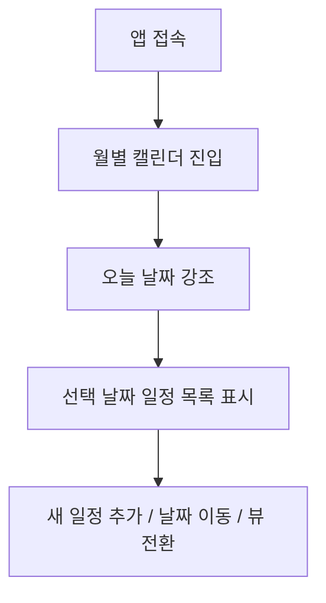
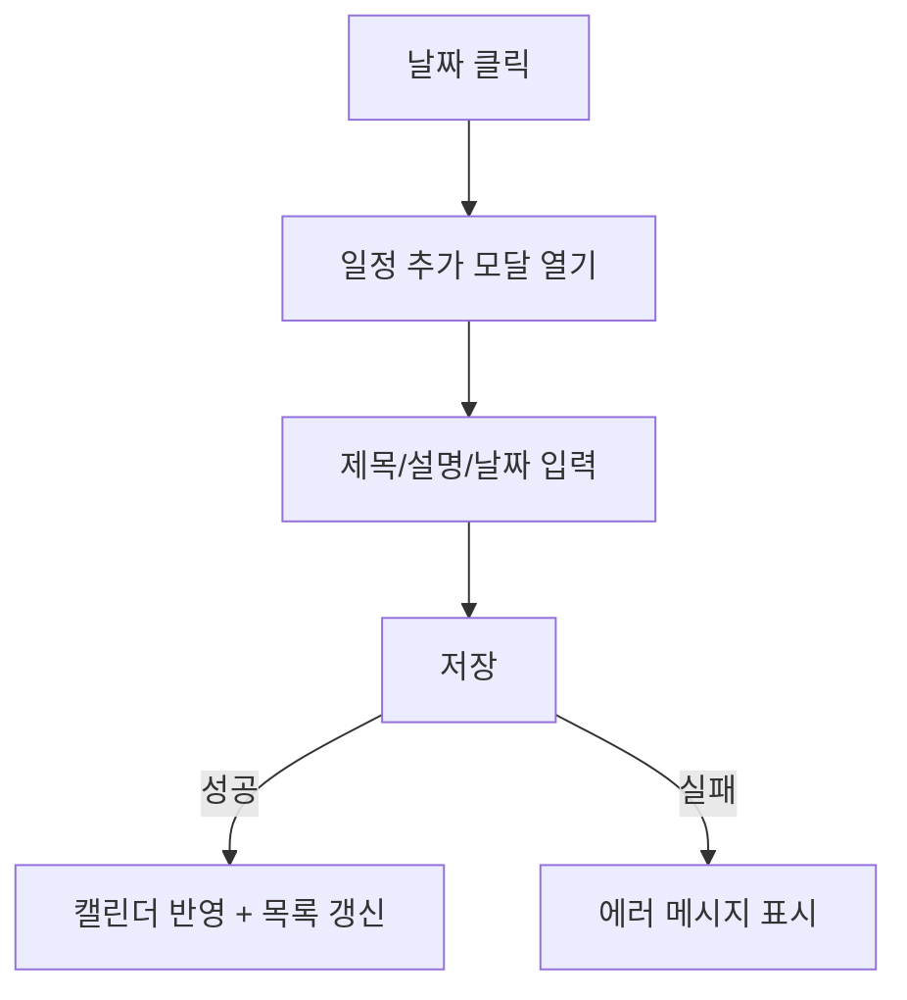

# Userflow

## 1. 목적

이 문서는 PlanMate의 주요 사용자 흐름을 정의한다.  
핵심 포인트는 아래 세 가지다.

- 일정 생성이 빠르고 직관적일 것
- 날짜 단위 탐색(일/주/월)이 자연스러울 것
- 반복 일정도 일반 일정처럼 이해하기 쉬울 것

## 2. 전제

- MVP는 단일 사용자 데모 버전이다.
- 첫 진입 시 로그인 절차는 없다.
- 메인 화면은 곧바로 캘린더 대시보드로 진입한다.

## 3. 메인 진입 흐름

1. 사용자가 앱에 접속한다.
2. 기본 화면은 **월별 캘린더 뷰**로 열린다.
3. 오늘 날짜는 강조 표시된다.
4. 현재 선택된 날짜의 일정 목록이 우측 패널(모바일은 하단 패널)로 보인다.
5. 상단에서 뷰 전환(일/주/월), 날짜 이동, 새 일정 추가를 수행할 수 있다.

## 4. 단일 일정 생성 흐름

1. 사용자는 날짜 셀을 클릭한다.
2. “일정 추가” 모달이 열린다.
3. 사용자는 제목, 설명, 날짜를 입력한다.
4. 반복 유형은 기본값 `없음`이다.
5. 저장 버튼을 누른다.
6. 서버 저장 성공 시 모달이 닫히고 캘린더에 즉시 반영된다.
7. 실패 시 에러 메시지를 보여주고 입력값은 유지한다.

## 5. 반복 일정 생성 흐름

1. 사용자는 일정 추가 모달을 연다.
2. 반복 유형에서 `매일 / 매주 / 매월` 중 하나를 선택한다.
3. 필요하면 반복 종료일을 입력한다.
4. 매주 반복인 경우 요일 선택을 추가로 제공한다.
5. 저장 시 하나의 “시리즈 이벤트”로 저장된다.
6. 월/주/일 조회 시 앱이 반복 규칙에 맞게 해당 범위 내 일정을 계산해 보여준다.

### UX 원칙
- 반복 일정은 생성 시 **예상 반복 방식이 읽히도록** 설명 문구를 함께 노출한다.
- 예: `매주 월, 수, 금 반복`, `매월 1일 반복`

## 6. 일별 보기 흐름

1. 사용자가 상단 탭에서 `일` 뷰를 선택한다.
2. 기준 날짜(anchor date)를 중심으로 하루 일정만 보여준다.
3. 해당 날짜의 일정이 시간 순서 또는 생성 순서로 목록화된다.
4. 완료 체크, 수정, 삭제를 상세하게 수행하기 가장 좋은 화면으로 사용한다.

### 일별 뷰 목적
- 오늘 할 일 집중
- 특정 날짜의 상세 관리
- 완료 체크 중심 작업

## 7. 주별 보기 흐름

1. 사용자가 `주` 뷰를 선택한다.
2. 기준 날짜가 포함된 한 주(월~일 또는 설정된 시작 요일 기준)를 렌더링한다.
3. 각 날짜 칸에 일정이 표시된다.
4. 사용자는 이번 주 일정 밀도를 빠르게 파악할 수 있다.
5. 특정 날짜 클릭 시 선택 상태가 바뀌고, 상세 목록 패널이 갱신된다.

### 주별 뷰 목적
- 이번 주 일정 분산 확인
- 과제/습관/스터디 루틴 파악
- 주간 계획 조정

## 8. 월별 보기 흐름

1. 사용자가 `월` 뷰를 선택한다.
2. 달력 형태로 1개월 범위를 렌더링한다.
3. 각 날짜 셀에 일정 개수 또는 일정 제목 일부를 표시한다.
4. 날짜를 클릭하면 우측/하단 상세 패널에 당일 일정이 표시된다.
5. 사용자는 일정이 몰린 날과 비교적 여유 있는 날을 한눈에 파악할 수 있다.

### 월별 뷰 목적
- 큰 일정 흐름 파악
- 시험/과제/루틴 집중 날짜 확인
- 월간 계획 수립

## 9. 일정 완료 처리 흐름

### 단일 일정
1. 사용자가 일정 카드의 체크박스를 클릭한다.
2. 해당 일정이 완료 상태로 표시된다.
3. UI는 즉시 변경되고, 서버 요청이 성공하면 상태가 유지된다.

### 반복 일정
1. 사용자가 특정 날짜에 표시된 반복 일정의 체크박스를 클릭한다.
2. 앱은 `이 시리즈 전체`가 아니라 **해당 발생일(occurrence)** 기준으로 완료 상태를 저장한다.
3. 같은 반복 일정이라도 다른 날짜 항목은 미완료 상태로 남는다.

## 10. 일정 수정 흐름

1. 사용자가 일정 카드를 클릭하거나 `수정` 버튼을 누른다.
2. 기존 정보가 채워진 수정 모달이 열린다.
3. 사용자는 제목/설명/날짜/반복 설정을 수정할 수 있다.
4. 저장 시 서버 반영 후 캘린더가 갱신된다.

### MVP 제약
- 반복 일정의 경우 **시리즈 전체 수정만 지원**
- 특정 발생일만 따로 수정하는 기능은 추후 버전

## 11. 일정 삭제 흐름

1. 사용자가 일정 카드에서 삭제 버튼을 누른다.
2. 확인 다이얼로그를 띄운다.
3. 사용자가 확인하면 삭제 요청을 보낸다.
4. 성공 시 캘린더와 상세 패널에서 제거된다.

### MVP 제약
- 반복 일정 삭제도 시리즈 전체 삭제 기준
- 특정 발생일만 건너뛰기/삭제는 미지원

## 12. 빈 상태와 오류 흐름

### 빈 상태
- 선택 날짜에 일정이 없으면 “아직 일정이 없어요. 새 일정을 추가해보세요.” 메시지 표시
- 월별 셀에는 일정 없음 표시 대신 깔끔한 빈 셀 유지

### 저장 실패
- 상단 또는 모달 내부 토스트로 실패 사유 표시
- 사용자가 다시 시도할 수 있도록 입력 내용 유지

### 조회 실패
- 캘린더 영역에 재시도 버튼 포함 에러 상태 표시
- 기존 화면을 즉시 지우지 말고, 가능한 경우 마지막 성공 데이터를 유지

## 13. 모바일 사용자 흐름

- 기본 진입은 월별 뷰
- 상세 목록 패널은 하단 드로어 또는 페이지 하단 영역으로 배치
- “새 일정 추가”는 플로팅 액션 버튼(FAB)으로 제공 가능
- 상단 툴바는 최소화해 뷰 전환과 날짜 이동만 우선 제공

## 14. 핵심 흐름 요약

가장 중요한 사용자 흐름은 아래 4개다.

1. 앱 접속 → 월별 화면 확인
2. 날짜 클릭 → 일정 추가
3. 주/월/일 뷰 전환 → 일정 탐색
4. 반복 일정 생성 → 특정 발생일 완료 처리

이 4개 흐름이 매끄럽게 동작하면 MVP 경험은 충분히 성립한다.
